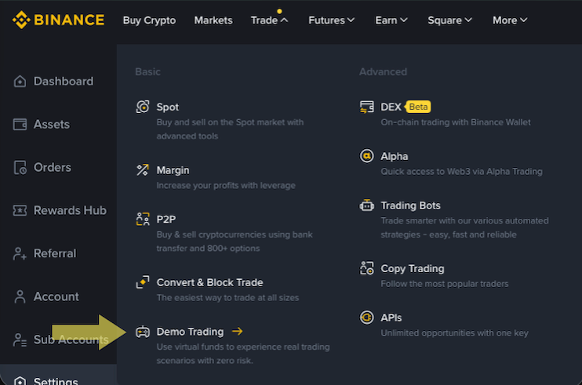
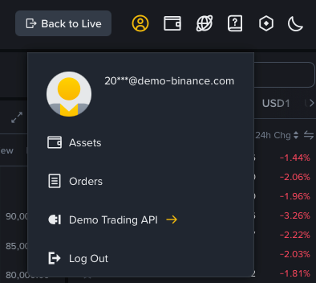
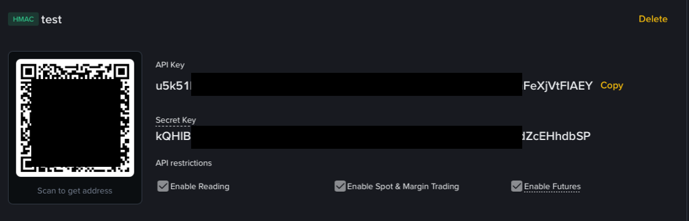
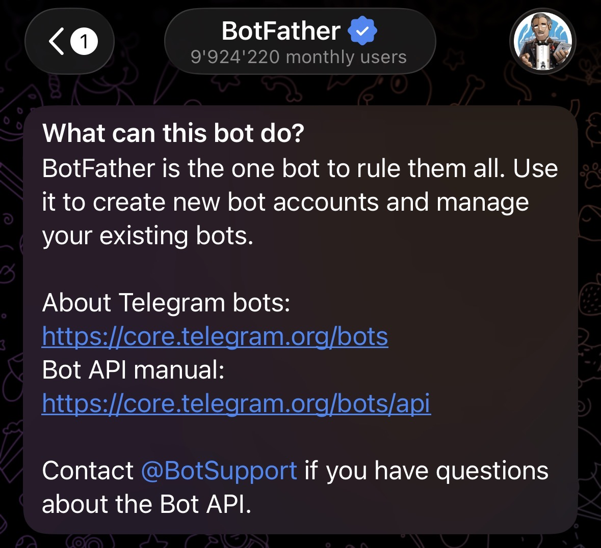
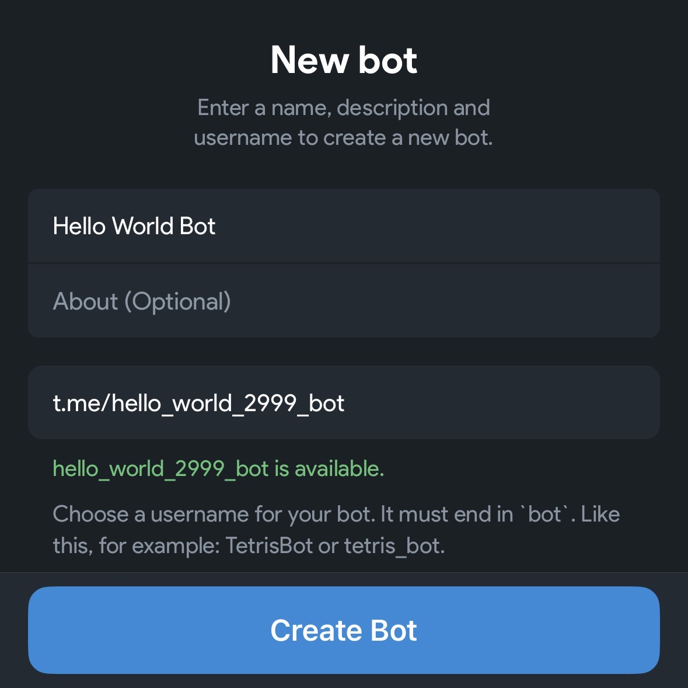
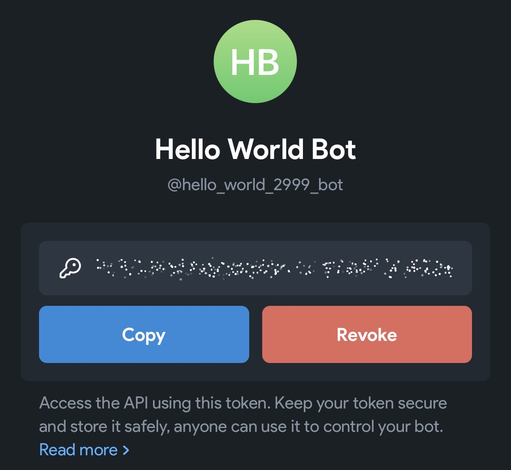
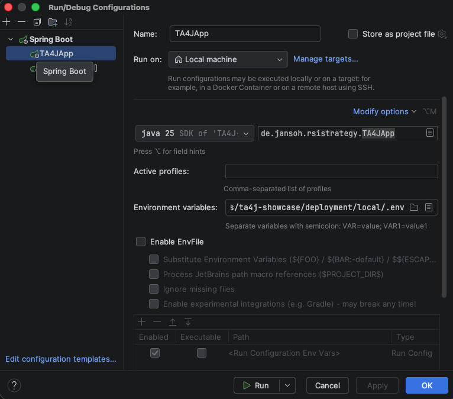

# TA4J Showcase

This is a Java [Spring Boot](https://spring.io/projects/spring-boot) example project demonstrating how to implement and execute trading strategies using the technical analysis framework [TA4J](https://github.com/ta4j/ta4j).

Currently, the project supports **USDM futures markets on Binance** via the Binance WebSocket and REST API.

**Future Goals:**
*   Abstract the API layer to support any broker.
*   Simplify the addition of custom strategies.

## ⚠️ Disclaimer

**The intention of this project is NOT to provide a fully functional trading bot.** This project is for **educational purposes only**.

*   **No Profit Guarantee:** None of the included strategies are guaranteed to generate profit.
*   **No Security Guarantee:** The implementation is not guaranteed to be secure or free of bugs.
*   **High Risk:** Trading involves significant risk. **Do not use this project (or parts of it) to trade real assets with real money.**

Most brokers provide demo accounts where you can test features in a simulated, risk-free environment. For instance, Binance offers a demo environment at: https://demo.binance.com/.

Although this project currently utilizes the Binance API, this is **not** an endorsement of Binance. Binance is not involved in this project. Binance was chosen solely because it provides a well-documented public API and a stable demo account.

## Prerequisites
* JDK 25
* Maven
* Docker (optional but recommended)

## How It Works

1.  **Startup:** On startup, all strategies defined in `application.properties` are loaded.
2.  **Data Feed:** A klines-provider is created for each strategy to fetch market data for the required symbol and timeframe.
3.  **Signal Detection:** When a price update is received, the connected strategy evaluates its entry and exit conditions.
4.  **Execution:**
    *   If an **entry condition** is met, a new position is opened via the broker's order API.
    *   The position is tracked until an **exit condition** is met or the **stop-loss** price is reached.
5.  **Persistence:** Closed positions are stored in the database.
6.  **Notifications:** A message is sent via Telegram (or printed to the console in non-production profiles) whenever a position is opened or closed.

## Build
We use Maven as a build tool here. You can build the project in the most simple way:
```bash
mvn clean package -DskipTests=true
```
I recommend skipping tests in the first run, because there are some integration tests using API commands what at least 
takes time but also can be unwanted.

## Configuration

To get started quickly, copy the environment variables from `deployment/template.env` and configure them.

### Prerequisites
*   Java (Version 17 or higher recommended)
*   MySQL 8 Database
*   Docker (optional, for local database setup)

### Database (MySQL)
This project works with any MySQL 8 database.

**Hibernate Auto-Update:**
Instead of manual initialization scripts, the project uses the Hibernate auto-update feature 
(`spring.jpa.hibernate.ddl-auto=update` in `application.properties`). You may turn this off and / or switch 
to [Flyway](https://www.red-gate.com/de/products/flyway/) at some point.
*   **Existing Database:** If using an existing instance, the `TA4J_MYSQL_ROOT` variable is not required. Ensure the user defined in `TA4J_MYSQL_USER` has permissions to create, alter, read, update, and delete tables.
*   **Docker Setup:** If using the provided Docker Compose file (`deployment/local/docker-compose.yml`), providing the root password via `TA4J_MYSQL_ROOT` is mandatory. Run `docker compose up -d` to set up the database automatically.

### Binance API (Demo)
**⚠️ WARNING:** Do not use a real API key. Using this project for real trading exposes you to a high risk of losing money.

1.  Create an account at [Binance](https://www.binance.com).
2.  Log in, hover over **Trade** in the top menu, and click **Demo Trading**.
    
3.  Hover over your account icon (top right) and click **Demo Trading API**.
    
4.  Click **Create API** (top right) and choose **System generated**.
5.  Enter a label for your key. Once generated, copy the credentials:
*   `BINANCE_API_KEY`: The **API Key**.
*   `BINANCE_API_SECRET`: The **Secret Key**.
    

*Note: You need a real Binance account to access the demo features, but no KYC or deposit is required.*

### Telegram Bot (Optional)
The Telegram bot is currently only active in the `prod` profile. In other profiles, messages are printed to the command line.
(With profile I mean Spring profiles. You can switch them providing the appropriate property e.g.: `--spring.profiles.active=prod`)

1.  Open Telegram and search for `BotFather`.
    
2.  Create a new bot. Provide a **Bot Name** (display name) and a unique **Username** (must start with `t.me/`).
    
3.  Copy the provided API Key.
4.  **Environment Variables:**
*   `TA4J_TG_BOT_NAME`: The bot username (e.g., `hello_world_2999_bot`).
*   `TA4J_TG_BOT_PW`: The API key provided by BotFather.
    

**Security Note:** This communication method is not encrypted end-to-end regarding the bot's visibility. Anyone who knows your bot's username can subscribe and read broadcasted messages. Currently, only position data and error messages are sent. **Never** extend the bot API to send personal information, passwords, or API keys.

### Application Properties
Additional options are available in `src/main/resources/application.properties`. Environment variables mentioned above can be referenced there. Ensure your JVM has access to these environment variables (particularly on Unix-based systems). All properties are documented directly within the file.

## Startup

### Option 1: IDE (e.g., IntelliJ IDEA)
Create a run configuration with the necessary environment variables.


### Option 2: Command Line
Since this is a standard Java application, you can run it via CLI:
```bash
java -jar target/your-application.jar --spring.profiles.active=prod
```
I've already added some profiles, you may customize them to your needs. Ofc the command above works using the default profile, too.
(Ensure environment variables are exported in your shell before running.)

Option 3: Docker

Use the configuration provided in `deployment/prod` to run the entire stack in a Docker environment.

```bash
docker compose -f deployment/prod/docker-compose.yml up -d
``
